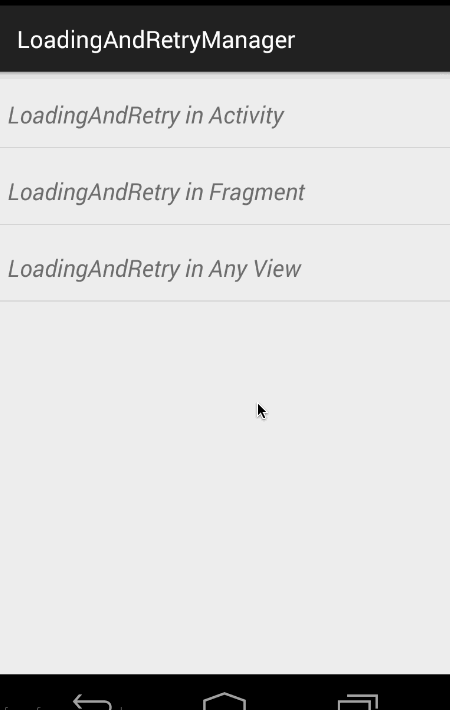
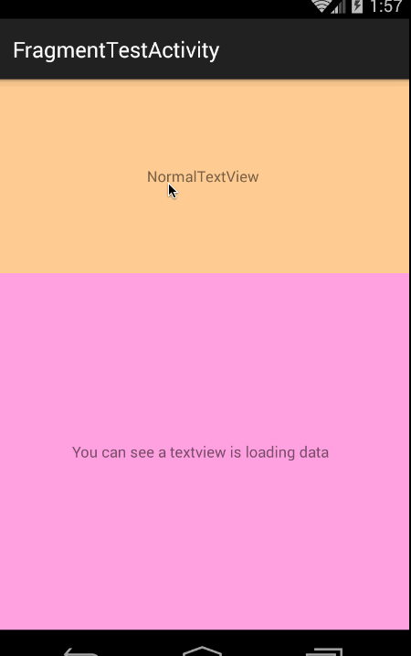

# LoadingAndRetryManager

无缝为Activity、Fragment、任何View设置等待（loading)、重试(retry)、无数据(empty)页面。


## How to Use

如果多个页面共享加载和重试页面，建议全局设置个基本的。比如在Application中：

```java
public class MyApplication extends Application
{
    @Override
    public void onCreate()
    {
        super.onCreate();
        LoadingAndRetryManager.BASE_RETRY_LAYOUT_ID = R.layout.base_retry;
        LoadingAndRetryManager.BASE_LOADING_LAYOUT_ID = R.layout.base_loading;
        LoadingAndRetryManager.BASE_EMPTY_LAYOUT_ID = R.layout.base_empty;
    }
}
```

在Activity中：

```java
public class MainActivity extends AppCompatActivity
{
    LoadingAndRetryManager mLoadingAndRetryManager;

    @Override
    protected void onCreate(Bundle savedInstanceState)
    {
        super.onCreate(savedInstanceState);
        setContentView(R.layout.activity_main);

        mLoadingAndRetryManager = LoadingAndRetryManager.generate(this, listener);

        loadData();
        
    }
```

只需要在onCreate中调用`LoadingAndRetryManager.generate(this,callback)`即可。

* 在Fragment中与Activity中用法一致。

* 为任何View添加，只需要将第一个参数改成对应的View即可。


如果需要针对单个Activity、Fragment、View定制页面，重写接口的回调方法：

```java
public View generateLoadingLayout()
{
   return null;
}

public View generateRetryLayout()
{
   return null;
}

public View generateEmptyLayout()
{
   return null;
}
```
即可，针对每个页面都有对应的设置事件的回调，如果有需求直接复写。

### API

* mLoadingAndRetryManager.showContent();
* mLoadingAndRetryManager.showRetry();
* mLoadingAndRetryManager.showLoading();
* mLoadingAndRetryManager.showEmpty();

## 效果图

* In Activity or Fragment 



* In Any View




